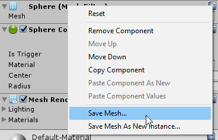

# Unity-MeshSaver
Save your Mesh as an asset file.

This UnityEditor script adds context menu items to your MeshFilter component, allowing you to save its UnityEngine.Mesh object as a .asset file that you can then reuse in your project.

This is great for saving procedurally generated meshes that may be too resource-intensive to generate at runtime.

# How to Install
Just copy the folder called MeshSaver into your project's Assets folder, or drag it into Unity's project panel.

# How to Use
  
  
1. Right click on a MeshFilter component's label or click on its gear icon to open up its context menu.
2. Then select either "Save Mesh..." or "Save Mesh As New Instance...".

**Save Mesh...** will save the current shared mesh as an asset file.  
**Save Mesh As New Instance...** will save a copy of the current mesh.  

Note that "Save Mesh..." will not work if the mesh comes from an imported 3D asset/prefab.
